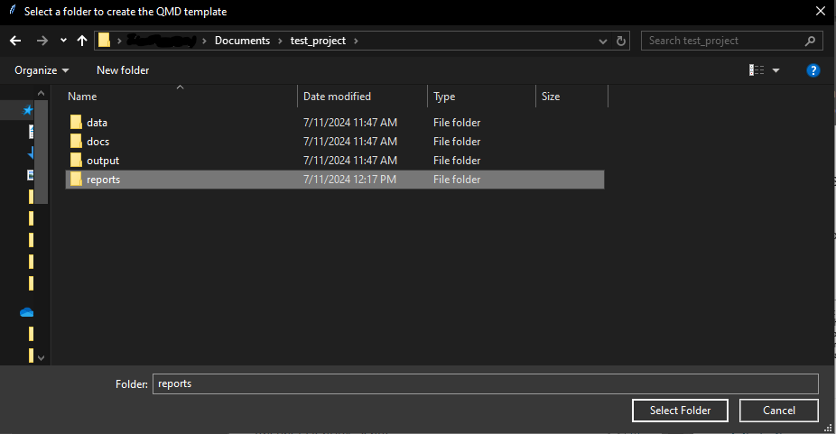
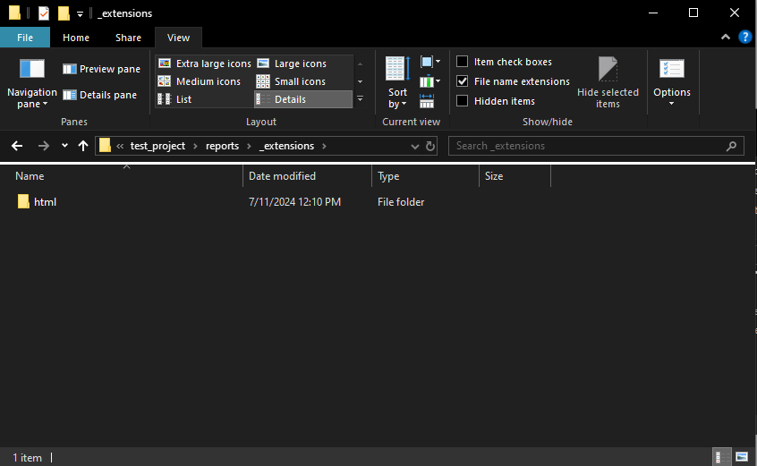
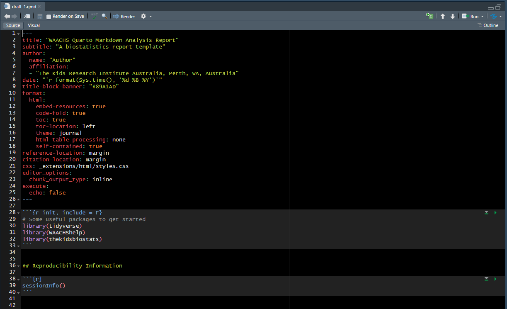
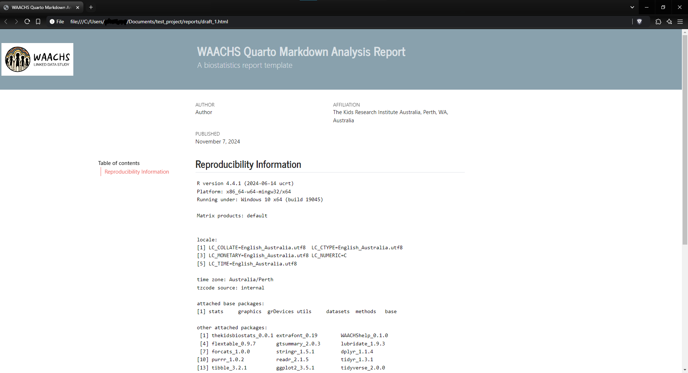

# Creating a blank Quarto markdown document

## Forward

Markdown is an invaluable tool for organising and presenting analytical
output. Ensuring consistent formatting and themes of analytical reports
across different topic areas is useful for the WAACHS project.

The `create_markdown` function calls some pre-made templates and renders
a pre-made template the analyst can use.

The function works well in conjunction with
[`WAACHShelp::create_project`](https://dempz.github.io/WAACHShelp/reference/create_project.md).

We are able to initialise both a HTML or Word document.

``` r
library(WAACHShelp)
```

## Function specifics

The function has a small set of arguments

- Set file name
  - `file_name` – What should this markdown document be called?
- Extension type
  - `ext_name` – should a HTML (`"html"`) or Word (`"word"`) report be
    generated? Default is HTML.

## Running the function

Let’s create a blank markdown document in HTML format called “draft_1”

### Step 1:

Run the function, and specify what we would like our report to be
called:

``` r
create_markdown(file_name = "draft_1",
                ext_name = "html")
```

This opens the following window:



Navigate to where you would like the template to be placed. I have
selected the “reports” folder.

### Step 2:

All done!

The template qmd file has been created, along with an `"_extensions"`
folder. The YAML header in this QMD file is now configured to a HTML
report. This houses all of our formatting and templating.


This extensions folder can be modified as necessary. The HTML report
contains a CSS file, and the Word report has a template Word document.



Opening the QMD file, we see the following YAML settings have been
populated for us. All we have to do is click Render.



The rendered HTML report can then be opened in a browser:


