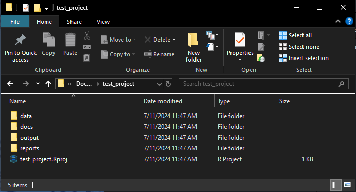

```{r, include = FALSE, message=F, warning=F}
knitr::opts_chunk$set(
  collapse = TRUE,
  comment = "#>"
)
```

# Forward

A clean environment to organise code, reports, data sets and documentation is crucial in large analytical projects.

The `create_project` function automatically creates a clean template environment, along with an R project file--anchoring working directories to enable simultaneously working across multiple projects. It works across all platforms--Windows, Mac, and Linux.

This vignette walks though what to expect in this project.


```{r setup, message=F, warning=F, error = F}
library(WAACHShelp) # Let's load the WAACHShelp package
```

# Function specifics

The `create_project` has a small set of arguments:

+ Project name
  + `project_name`
+ Folders -- should the following folders be created for the project? The default for these is true.
  + `data`
  + `reports`
  + `output`
  + `docs`

# Running the function

Suppose we have just created an empty folder for a project wherever we like (could be local, in a network drive, etc.).

## Step 1:

Create a folder for our project contents to sit. 

For the sake of this example, I have created a folder called "test_project" in Documents.


## Step 2:

Now we can run our function in R. This can be done from a null project, or from terminal.

I have left all of the `data`, `reports`, `output`, arguments as default (`TRUE`). This means they will all be created.

```{r eval = F}
create_project(project_name = "test_project")
```

This opens the following window:

```{r, echo=FALSE, out.width="95%"}
knitr::include_graphics("images/create_project/2_prompt.png")
```

Navigate to the `test_project` folder we created earlier.

## Step 3: 

Done!

All of the folders have been created, in addition to an R project that takes the name given by the `project_name` argument.

```{r, echo=FALSE, out.width="95%"}

```
